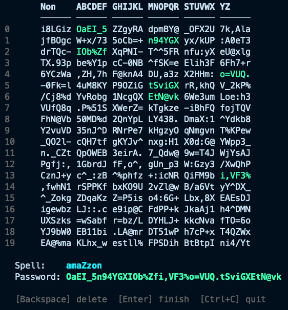

# moria

A deterministic, matrix-based password generator. Generate unique, strong passwords for every service from a single master password and a memorable spell.

> *"Speak, friend, and enter."* — Your spell is the password. The matrix is the mine.



## Core Concept

`moria` uses a **password matrix** — a grid of random character fragments — combined with a **spell** (any memorable string like "amazon" or "gmail") to derive unique passwords. The same master password + spell always produces the same password.

```
Master Password (secret) + Spell (service name) → Unique Password
```

## Features

- **Deterministic** — same inputs always produce the same output
- **Case-sensitive spells** — "amazon" and "AMAZON" produce different passwords
- **No password storage** — passwords are derived on-demand, never stored
- **Shell-safe master passwords** — generated passwords avoid shell metacharacters
- **Interactive live mode** — type your spell and watch the password build in real-time
- **Pretty matrix display** — visualize the password matrix for verification
- **Masked password input** — enter your master password with hidden characters (•••)
- **Configurable** — all matrix dimensions are compile-time constants

## Installation

```bash
git clone https://github.com/kiviuk/moria.git
cd moria
make build
```

The binary is built to `bin/moria`.

## Quick Start

### 1. Generate a Master Password

```bash
./bin/moria --magic
```

This outputs a 1,200-character shell-safe random string. **Save this securely** — it's your master key. You have two options for using it:

**Option A: Save to a file and pipe it**
```bash
./bin/moria --magic > master.txt
cat master.txt | ./bin/moria "amazon"
```

**Option B: Store in a password manager**
Save the output to KeePass, 1Password, or any password manager. When you need a service password, paste it into the interactive prompt:
```bash
./bin/moria "amazon"
# You'll be prompted to paste your master password (input is masked with •••)
```

**Option C: Use an existing secret as your master key**
You don't need to generate a new password — you can use any existing secret like an SSH private key, a GPG key, or a long passphrase. The tool will deterministically expand it to fill the matrix:
```bash
cat ~/.ssh/id_ed25519 | ./bin/moria "amazon"
```
This is convenient if you already have a secure key you trust and don't want to manage another secret.

### 2. Generate a Service Password

```bash
# Interactive (enter master password with masked input)
./bin/moria "amazon"

# Piped (from password manager)
cat master.txt | ./bin/moria "amazon"
```

Output: a unique password derived from your master password + the spell "amazon".

### 3. Display the Matrix

```bash
cat master.txt | ./bin/moria --pretty
```

Shows the full password matrix with column headers:

```
       Non      ABC      DEF      GHI      JKL      MNO      PQR      STU      VWX      YZ
       ──────   ──────   ──────   ──────   ──────   ──────   ──────   ──────   ──────   ──────
0      xK9!mP   2@nQ7#   rT5$wY   8aBcD4   eF6gH7   jK1lM2   nO3pQ4   rS5tU6   vW7xY8   zA9bC0
1      ...
...
```

### 4. Interactive Live Mode

```bash
cat master.txt | ./bin/moria --live
```

Type your spell character by character. The matrix highlights visited cells and the password builds in real-time. Press Enter to output the final password.

### 5. Limit Password Length

Some sites cap password length. Use `--max-len` to truncate:

```bash
cat master.txt | ./bin/moria --max-len 16 "amazon"
```

## How It Works

### The Algorithm

1. **Master Password → Matrix**: Your master password is deterministically expanded into a grid of random character fragments
2. **Spell → Path**: Each character in your spell determines a cell to read:
   - **Row** = character position in spell, modulo `PasswordMatrixRows` (uppercase letters shift by `PasswordMatrixRows/2`)
   - **Column** = letter group (A-C→1, D-F→2, ..., Y-Z→9, non-letters→0)
3. **Extract Password**: Concatenate the cell contents along the path

### Example

Spell: `"amazon"` (6 characters)

| Char | Position | Row | Group | Column | Cell |
|------|----------|-----|-------|--------|------|
| a | 0 | 0 | 1 | 1 | (0,1) |
| m | 1 | 1 | 5 | 5 | (1,5) |
| a | 2 | 2 | 1 | 1 | (2,1) |
| z | 3 | 3 | 9 | 9 | (3,9) |
| o | 4 | 4 | 5 | 5 | (4,5) |
| n | 5 | 5 | 5 | 5 | (5,5) |

Output: 6 cells × 6 chars = 36-character password.

### Case Sensitivity

Uppercase letters shift the row by `PasswordMatrixRows/2`, making `"amazon"` and `"AMAZON"` produce completely different passwords. This adds entropy without requiring a longer spell.

## Security Model

### What's Secret
- **Master password** — the random string (or any input like an SSH key). This is your only secret.

### What's Public
- **Spell** — the service name (e.g., "amazon"). An attacker knowing this gets nothing without the master password.

### Entropy
- **Matrix**: 1,200 chars × ~6 bits/char = ~7,200 bits of entropy
- **Password**: For a 6-letter spell, 36 chars × ~6 bits = ~216 bits
- **Brute force**: Computationally infeasible

### Key Derivation

Your master password goes through a two-stage process to become the matrix:

1. **Argon2id** — Your input is first passed through Argon2id (1 iteration, 64MB memory, 2 threads), a memory-hard key derivation function. This slows down the derivation to ~500ms, making brute-force attacks computationally expensive even if your master password is weak.
2. **HKDF-SHA256** — The 32-byte high-entropy output from Argon2id is then expanded to the full matrix size (1,200 characters) using HKDF.

This means you can safely use a memorable passphrase, an SSH key, or any other input:

```bash
cat ~/.ssh/id_ed25519 | ./bin/moria "amazon"
```

### Rejection Sampling

When generating random passwords, a common mistake is to use the modulo operator (`%`) to map random bytes to a character set. This introduces **modulo bias** — some characters become slightly more likely than others, weakening the password.

Moria uses **rejection sampling** instead: if a random byte falls in the "biased" range, it's discarded and a new byte is drawn. This guarantees every character in the pool has exactly equal probability, preserving the full entropy of your passwords.

Imagine you have a 52-card deck and want to randomly pick a number from 1 to 10. If you just divide the card value by 10 and take the remainder, the numbers 1 and 2 would come up more often than the rest — because 52 doesn't divide evenly by 10, leaving 2 "extra" cards that loop back to the beginning.
Rejection sampling fixes this by saying: "If you draw one of those extra cards, put it back and draw again." You keep drawing until you get a card from the fair range. The result is that every number from 1 to 10 has exactly the same chance of being picked.
In moria's case, a random byte can be 0–255 (256 values), but the character pool might be 64 characters. Since 256 doesn't always divide evenly into the pool size, some characters would be slightly more likely without rejection sampling. By discarding the "extra" bytes and drawing fresh ones, every character gets a perfectly fair shot.

## Configuration

All matrix dimensions are compile-time constants in `internal/app/config.go`:

| Constant | Default | Description |
|----------|---------|-------------|
| `PasswordMatrixRows` | 20 | Number of rows (position modulus) |
| `CharactersPerMatrixCell` | 6 | Characters per cell (password length multiplier) |
| `AlphabetSize` | 26 | Letters in the alphabet |
| `MasterPasswordChars` | 64 chars | Shell-safe character pool for `--magic` |

To change the matrix size, edit the constants and run `make test && make build`. All tests pass with any value.

## CLI Reference

```
Usage: moria [--magic|--pretty|--live] [--max-len N] <spell>

Options:
  --magic    Generate a master password
  --pretty   Display the password matrix from your master password
  --live     Interactive mode: type your spell and see the password build in real-time
  --max-len  Truncate output to N characters (live and batch modes only)
  -h, --help Show this help message
```

## Project Structure

```
moria/
├── cmd/moria/
│   ├── main.go                # CLI entry point
│   ├── live.go                # Bubbletea TUI for interactive mode
│   ├── live_test.go           # Tests for live mode
│   ├── main_test.go           # Tests for CLI, flag parsing, validation
│   └── password_prompt.go     # Bubbletea password input prompt
├── internal/
│   ├── app/
│   │   ├── config.go               # Package-level constants
│   │   ├── spell.go                # Core domain types (MagicLetter, QueryLetter, etc.)
│   │   ├── spell_test.go           # Tests for parsing, grouping, resolution
│   │   ├── password_matrix.go      # Matrix type, generation, Pretty(), Cell access
│   │   └── password_matrix_test.go # Matrix dimension, content, and integration tests
│   └── testutil/
│       └── testutil.go             # Shared test data generator (no import cycles)
├── go.mod
└── Makefile
```

## Testing

```bash
make test                          # Run all tests
go clean -testcache && make test   # Clear cache and re-run
go test ./internal/app/ -v         # Verbose output for app tests
go test ./cmd/moria/ -v            # Verbose output for cmd tests
go test ./... -run TestQuery       # Run single test by name
```

All tests pass with any `CharactersPerMatrixCell` and `PasswordMatrixRows` values — expected values are computed from constants, not hardcoded.

## License

MIT
