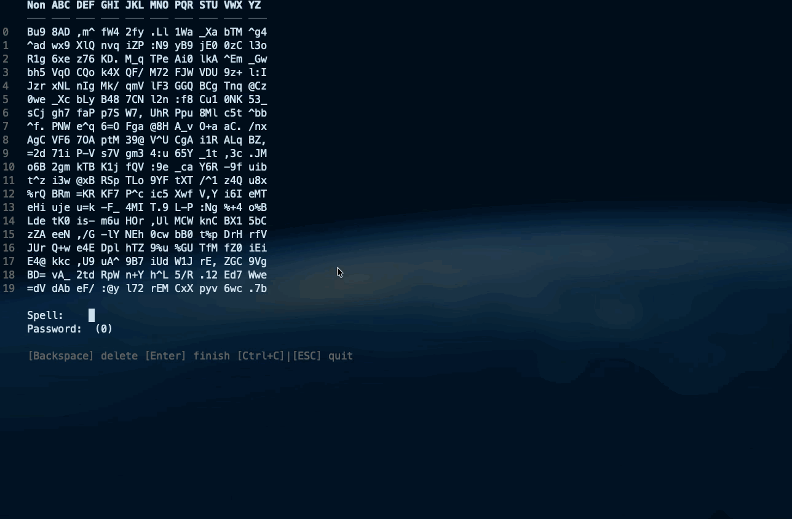

# moria

A deterministic, matrix-based password generator. Derive unique, reproducible passwords from a master secret and a memorable spell.

```
Master Secret + Spell → Password
```

> *"Speak, friend, and enter."* — Your spell is the password. The matrix is the mine.



Inspired by [pwgen](https://www.uni-muenster.de/CERT/pwgen/index.php?lang=en&mode=pwcard) · Based on [zxcvbn](https://github.com/ccojocar/zxcvbn-go) and [Argon2id](https://en.wikipedia.org/wiki/Argon2) · Videos: [zxcvbn](https://www.youtube.com/watch?v=vf37jh3dV2I) [Argon2id](https://youtu.be/Sc3aHMCc4h0?t=114)

## Core Concept

`moria` uses a **password matrix** — a grid of random character fragments — combined with a **spell** (any memorable service name or phrase) to derive unique passwords. The same master secret + spell always produces the same password.

## Installation

```bash
git clone https://github.com/kiviuk/moria.git
cd moria
make build
```

The binary is built to `bin/moria`.

## Quick Start

moria needs two inputs: a **master secret** (your only secret — never echoed to the terminal) and a **spell** (one per service). Each can be supplied in two ways:

| Input | How to provide | Notes |
|---|---|---|
| **Master secret** | Pipe from file: `cat key \| moria` | Recommended — key never touches the terminal |
| | Interactive prompt when no pipe | Input masked with `•••` |
| **Spell** | Interactive prompt (omit from command line) | Never recorded in shell history or `ps` |
| | Command-line argument: `moria "amazon"` | Visible in shell history and `ps aux` |

### Input Flows

```bash
# ① Pipe master, type spell when prompted  (most private)
cat ~/.ssh/id_ed25519 | moria | pbcopy
#   Enter spell: _

# ② Pipe master, spell on argv  (convenient for scripting)
cat ~/.ssh/id_ed25519 | moria "amazon" | pbcopy

# ③ Fully interactive — prompted for both  (no file, no args)
moria
#   Enter master password: •••••••••••••••
#   Enter spell: _
```

### Choosing a Master Secret

**Option A — Use your SSH key (recommended):** no new secret to manage; your existing key is your master.

```bash
cat ~/.ssh/id_ed25519 | moria | pbcopy
```

**Option B — Generate a dedicated master password:**

```bash
moria --magic          # prints a 600-char cryptographically secure string
moria --magic > key.txt && chmod 600 key.txt   # save it, then use it:
cat key.txt | moria | pbcopy
```

### Modes

| Command | Description |
|---|---|
| `cat key \| moria "spell"` | **Batch** — output password to stdout |
| `cat key \| moria` | **Batch** — master piped, spell prompted interactively |
| `moria` | **Batch** — both master and spell prompted interactively |
| `cat key \| moria --live` | **Live** — type spell character by character, see password build in real-time |
| `cat key \| moria --pretty` | **Pretty** — display the full password matrix |
| `cat key \| moria --max-len 16 "spell"` | Truncate output to 16 characters |
| `echo "passphrase" \| moria --show-strength` | Analyze master password strength |
| `moria --magic` | Generate a new master password |

### Live Mode

Type your spell character by character. The matrix highlights visited cells and the password builds in real-time. Press Enter to copy the final password.

```bash
cat ~/.ssh/id_ed25519 | moria --live
# or fully interactive:
moria --live
```

```
Spell:    amazon
Password: xK9!nQ7# (8/8)
```

> Live mode keeps the entered spell in Bubbletea's memory until GC. For maximum security, prefer batch mode.

### Display the Matrix

```bash
cat the-key.txt | moria --pretty
```

```
       Non    ABC    DEF    GHI    JKL    MNO    PQR    STU    VWX    YZ
       ────   ────   ────   ────   ────   ────   ────   ────   ────   ────
0      xK9!   nQ7#   5$wY   BcD4   6gH7   1lM2   3pQ4   5tU6   7xY8   9bC0
1      ...
...
```

### Limit Password Length

Some sites cap password length. Use `--max-len` to truncate:

```bash
cat the-key.txt | moria --max-len 16 "amazon"
# → xK9!nQ7#5$wYBcD4
```

### Check Master Password Strength

```bash
echo "i'm super hunger today" | moria --show-strength
```

```
zxcvbn master password entropy: 50 bits

zxcvbn crack time estimate (generic): centuries

Assuming attacker 100K guesses/sec and 50 bits (from zxcvbn), worst case: 357 years
```

## Security Model

Your master password and spell are secret. The generated password is what you use to log in.

| Component | Secret? | Notes |
|-----------|---------|-------|
| **Master password** | Yes | Your only secret. Compromise = total loss. |
| **Spell** | Yes | Your memorable phrase per service. Keep private. |
| **Generated password** | Until leaked | What you type to log in. Safe if master is secure. |

> **Note on spell visibility:** When the spell is passed as a command-line argument (`moria "amazon"`), it is visible in `ps aux`, shell history, and OS audit logs. For most use cases (service names like `"amazon"`, `"github"`) this is low risk. If your spell is sensitive, run `moria` without arguments (or with just a pipe) so the spell is entered interactively via the prompt — it will never appear in the process list or shell history.

## Understanding Your Security

The strength of your derived passwords is limited by your master password. A long spell cannot compensate for a weak master.

`--show-strength` analyzes your master password strength using `zxcvbn` pattern detection:

```bash
echo "i'm super hunger today" | moria --show-strength
```

[zxcvbn](https://github.com/ccojocar/zxcvbn-go) detects that `"i'm super hunger today"` is four common English words. Instead of multiplying 22 × 6 bits (which assumes random gibberish), it calculates the actual entropy of a dictionary-word passphrase.

The **357 years** estimate is calculated as: `(2^50 guesses) ÷ (100K guesses/sec)`. The 50 bits reflects the effective entropy after accounting for dictionary patterns.

All four words are common, but zxcvbn can't detect *semantic combinations*. It sees 4 dictionary words, not a specific phrase. **Pattern detection is limited to what attackers precompute**.

**Practical takeaway:** Combine common words in unique, memorable ways. Even simple phrases are safer than you think because attackers can't precompute every possible combination.

## Configuration

All matrix dimensions are compile-time constants in `internal/app/config.go`:

| Constant | Default | Description |
|----------|---------|-------------|
| `PasswordMatrixRows` | 20 | Number of rows (position modulus) |
| `CharactersPerMatrixCell` | 3 | Characters per cell (password length multiplier) |
| `AlphabetSize` | 26 | Letters in the alphabet |
| `MasterPasswordChars` | 73 chars | Bash-friendly characters for `--magic` |

To change the matrix size, edit the constants and run `make test && make build`. All tests pass with any value.

## CLI Reference

```
Usage: moria [--magic|--pretty|--live|--show-strength] [--max-len N] [--ignore-paste] [--] [<spell>]

Options:
 --magic          Generate a master password
 --pretty         Display the password matrix from your master password
 --live           Interactive mode: type your spell and see the password build in real-time
 --show-strength  Show strength of password from stdin (standalone mode)
 --max-len N      Truncate generated output to N characters (live and batch modes only)
 --ignore-paste   Ignore pasted input in live mode (single characters only, live mode only)
 --               Spell separator (use before spells starting with --)
 -h, --help       Show this help message

Examples:
  moria --magic                               # Generate a new master password
  moria "amazon"                              # Prompted for master, spell on argv
  moria                                       # Prompted for master, then for spell
  cat master.txt | moria "amazon"             # Master piped, spell on argv
  cat master.txt | moria                      # Master piped, prompted for spell
  cat master.txt | moria --pretty             # Display the matrix
  cat master.txt | moria --live               # Interactive live mode (paste allowed)
  cat master.txt | moria --live --ignore-paste # Interactive live mode (paste blocked)
  cat master.txt | moria --max-len 16 "amazon" # Limited length
```

## Project Structure

```
moria/
├── cmd/moria/
│   ├── main.go                     # CLI entry point, input state machine, run loop
│   ├── live.go                     # Bubbletea TUI for interactive live mode
│   ├── live_test.go                # Tests for live mode model
│   ├── password_prompt.go          # Bubbletea masked password input prompt (•••)
│   ├── spell_prompt.go             # Bubbletea spell input prompt (visible text)
│   ├── debug_helpers.go            # debugf() logging (MORIA_DEBUG env var)
│   ├── messages.go                 # All CLI error messages and UI strings
│   ├── main_test.go                # Tests for batch mode, flag parsing, validation
│   ├── cli_integration_test.go     # Integration tests (pipe + runCLI helper)
│   ├── cli_pty_integration_test.go # Integration tests using MORIA_MASTER_FILE/SPELL
│   ├── read_stdin_test.go          # Tests for readStdin / size limits
│   └── test_main_test.go           # TestMain: builds binary once for all CLI tests
├── internal/
│   ├── app/
│   │   ├── config.go               # Package-level constants
│   │   ├── spell.go                # Core domain types (MagicLetter, QueryLetter, etc.)
│   │   ├── spell_test.go           # Tests for parsing, grouping, resolution
│   │   ├── password_matrix.go      # Matrix type, generation, Pretty(), Cell access
│   │   ├── password_matrix_test.go # Matrix dimension, content, and integration tests
│   │   ├── secure_bytes.go         # SecureBytes type for in-memory secret management
│   │   ├── secure_bytes_test.go    # Tests for SecureBytes
│   │   ├── strength.go             # Time-to-guess calculation and human-readable formatting
│   │   └── strength_test.go        # Tests for CrackTime, FormatSeconds, Entropy
│   └── testutil/
│       └── testutil.go             # Shared test data generator (no import cycles)
├── .golangci.yml                   # golangci-lint configuration
├── go.mod
└── Makefile
```

## Testing

```bash
make test                          # Run all tests
make lint                          # Run golangci-lint
go clean -testcache && make test   # Clear cache and re-run
go test ./internal/app/ -v         # Verbose output for app tests
go test ./cmd/moria/ -v            # Verbose output for cmd tests
go test ./... -run TestQuery       # Run single test by name
```

All tests pass with any `CharactersPerMatrixCell` and `PasswordMatrixRows` values — expected values are computed from constants, not hardcoded.

## Cross-Compilation

Pre-built binaries for other platforms can be cross-compiled on any machine.

| Target | Command | Output |
|--------|---------|--------|
| macOS (default) | `make build` | `bin/moria` |
| Windows x86-64 | `make win64` | `bin/win64/moria.exe` |
| Linux x86-64 | `make linux64` | `bin/linux64/moria` |

All cross-compiled binaries use `CGO_ENABLED=0` and are stripped of debug info (`-ldflags="-s -w"`).

## License

MIT
